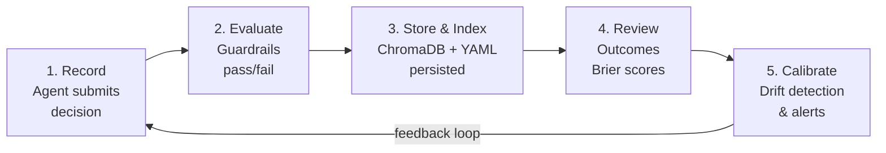

# Product Overview

## What Is Cognition Engines?

**Cognition Engines** is the intelligence layer for AI agent decision-making. It extends the [agent-decisions](https://github.com/tfatykhov/agent-decisions) project with three core pillars:

| Pillar | Purpose |
|--------|---------|
| **Accelerators** | Cross-agent learning through semantic decision querying, hybrid retrieval, and pattern detection |
| **Bridge Definitions** | Dual-indexing of decisions by structure (form) and function (purpose) |
| **Deliberation** | Full chain-of-thought capture with step-by-step reasoning traces |
| **Guardrails** | Policy enforcement that prevents violations before they occur |
| **MCP Transport** | Native integration with any MCP-compliant agent via Model Context Protocol |

Inspired by Cisco Outshift's [Internet of Cognition](https://outshift.cisco.com/blog/from-connection-to-cognition-scaling-superintelligence) architecture, Cognition Engines provides a shared cognitive substrate for multi-agent systems.

---

## Core Value Proposition

### 1. Semantic Decision Memory

Every decision made by any agent is embedded as a high-dimensional vector (via Google Gemini `text-embedding-004`) and stored in **ChromaDB**. Any agent can later query the collective memory:

```
"Has anyone made a similar decision before?"
"What happened last time we chose PostgreSQL for agent memory?"
```

### 2. Policy Enforcement at Decision Time

YAML-defined guardrails are evaluated **before** an agent commits to a decision. Rules can block, warn, or log:

```yaml
- id: no-high-stakes-low-confidence
  description: High-stakes decisions need minimum confidence
  condition_stakes: high
  condition_confidence: "< 0.5"
  action: block
  message: High-stakes decisions require ≥50% confidence
```

### 3. Confidence Calibration & Feedback Loop

The system tracks predicted confidence vs. actual outcomes over time, computing **Brier scores** per agent, per category, and per confidence bucket. This reveals whether agents are over-confident, under-confident, or well-calibrated.

The feedback loop (v0.8.0) enables agents to record decisions, review outcomes, retrieve calibration statistics, and auto-attribute outcomes — closing the cycle between prediction and actuality. Rolling calibration windows (v0.9.0) with drift alerts detect when decision quality degrades over time.

### 4. Cross-Agent Federation (CSTP)

The **Cognition State Transfer Protocol** (CSTP v0.9.0) exposes all capabilities via a JSON-RPC 2.0 API over HTTP, allowing remote agents to query, record, and review decisions across organizational boundaries.

### 5. MCP Integration (Model Context Protocol)

Since v0.9.0, Cognition Engines exposes all decision intelligence capabilities as **MCP tools**, enabling native integration with Claude Desktop, Claude Code, OpenClaw, and any MCP-compliant client. Two transports are supported:

- **Streamable HTTP** — `POST`/`GET` to `/mcp` on the existing CSTP server (port 8100)
- **stdio** — `python -m a2a.mcp_server` for local or Docker-based access

The MCP layer is a **zero-duplication bridge** — each MCP tool maps 1:1 to an existing CSTP service method.

---

## Key Features

| Feature | Status | Version |
|---------|--------|---------|
| Semantic Decision Index | ✅ Shipped | v0.5.0 |
| Pattern Detection Engine | ✅ Shipped | v0.6.0 |
| Enhanced Guardrails + Audit Trail | ✅ Shipped | v0.6.0 |
| Cross-Agent Federation (CSTP) | ✅ Shipped | v0.7.0 |
| Decision Recording (`cstp.recordDecision`) | ✅ Shipped | v0.7.1 |
| Project Context & Attribution | ✅ Shipped | v0.7.2 |
| Web Dashboard | ✅ Shipped | v0.7.4 |
| Feedback Loop (`recordDecision`, `reviewDecision`, `getCalibration`, `attributeOutcomes`) | ✅ Shipped | v0.8.0 |
| Rolling Calibration & Drift Alerts | ✅ Shipped | v0.9.0 |
| Confidence Variance Detection | ✅ Shipped | v0.9.0 |
| Hybrid Retrieval (BM25 + Semantic) | ✅ Shipped | v0.9.0 |
| MCP Server (5 tools, stdio + Streamable HTTP) | ✅ Shipped | v0.9.0 |
| Bridge-Definitions (F024) | ✅ Shipped | v0.9.1 |
| Deliberation Traces (F023) | ✅ Shipped | v0.9.1 |
| Shared Intent Protocol | 📋 Future | — |
| Context Graphs | 📋 Future | — |
| Multi-Agent Cognition Network | 📋 Future | — |

---

## Framework Compatibility

Cognition Engines is **agent-framework agnostic** — it is pure Python + ChromaDB and works with:

- **LangChain / LangGraph** — Add as a tool or pre-decision hook
- **AutoGen** — Integrate into agent decision steps
- **CrewAI** — Expose as a custom tool
- **Claude Desktop / Claude Code** — Connect via MCP (stdio or Streamable HTTP)
- **OpenClaw** — Connect via MCP or direct HTTP
- **Any MCP client** — Native tool discovery and invocation
- **Any Python agent** — Import directly or call via HTTP/CLI

---

## Technology Stack

| Layer | Technology |
|-------|------------|
| Language | Python 3.11+ |
| API Framework | FastAPI (async, JSON-RPC 2.0) |
| MCP Transport | `mcp` SDK — Streamable HTTP + stdio |
| Vector Database | ChromaDB (semantic search) |
| Keyword Search | BM25 via `rank-bm25` |
| Embeddings | Google Gemini `text-embedding-004` (768-dim) |
| Dashboard | Flask + Jinja2 |
| Authentication | Bearer token (constant-time comparison) |
| Containerization | Docker (multi-stage build) |
| Build System | Hatchling (`pyproject.toml`) |
| Testing | pytest + pytest-asyncio + pytest-cov |
| Linting | ruff + mypy (strict) |

---

## Decision Lifecycle



1. **Record** — An agent records a decision with confidence, category, stakes, reasons, and optional project context.
2. **Evaluate** — Guardrails are evaluated against the decision context. Violations block or warn.
3. **Store** — The decision is written to a YAML file and indexed into ChromaDB with Gemini embeddings.
4. **Review** — After outcomes are known, the decision is reviewed (success/failure/partial/abandoned).
5. **Calibrate** — Brier scores and calibration buckets are computed. Rolling windows and drift detection compare recent vs. historical accuracy.
