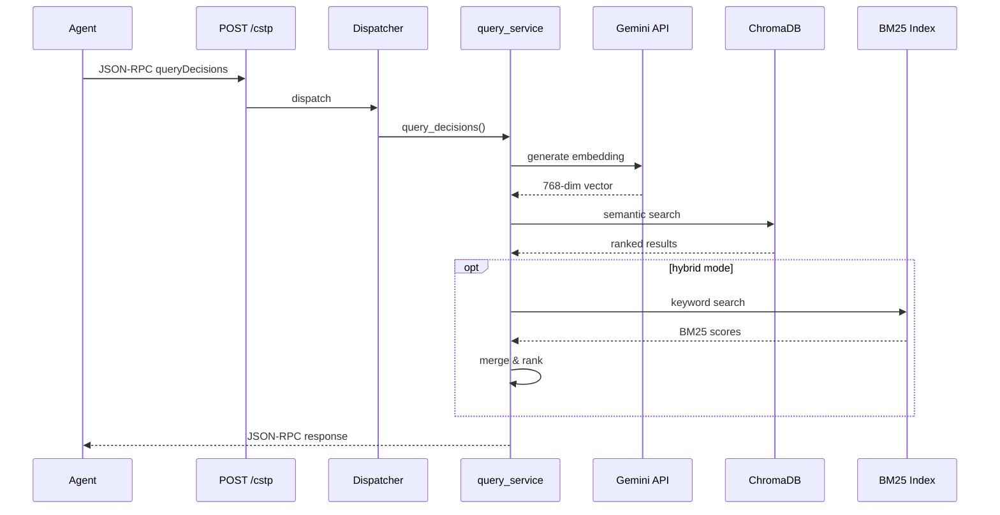
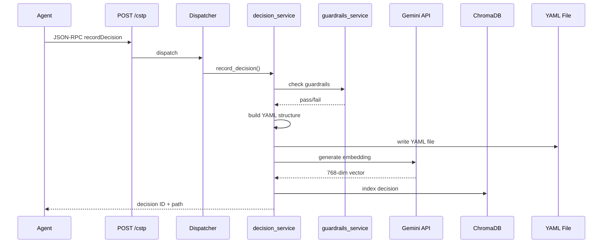
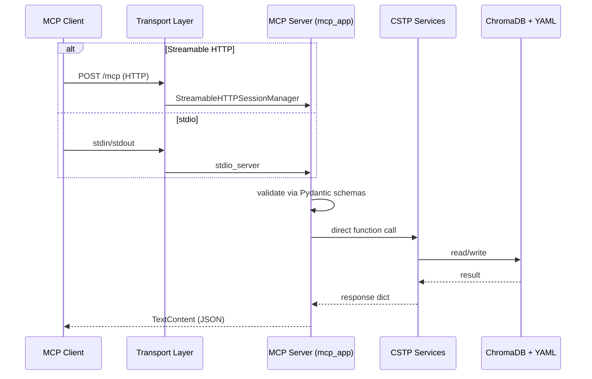
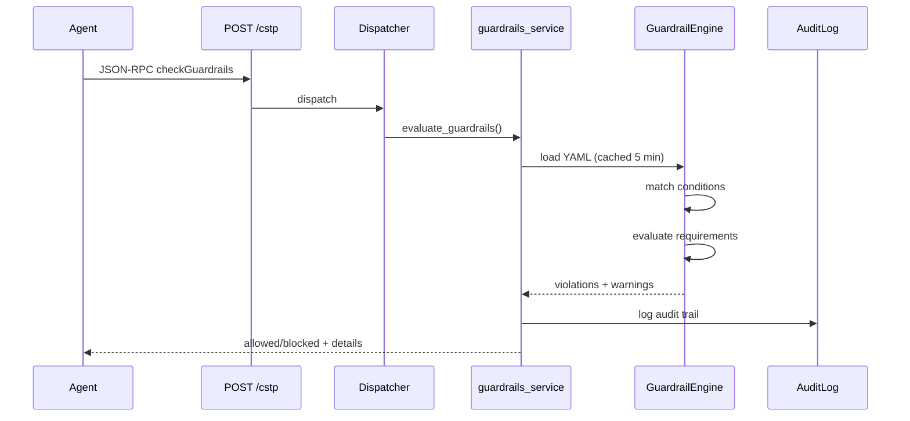
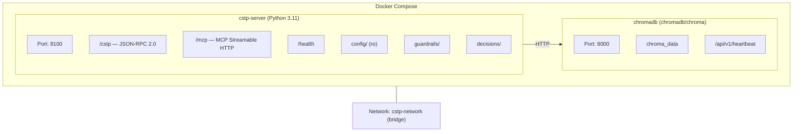

# System Architecture

## High-Level Architecture

```mermaid
graph TB
    subgraph Agents["AI AGENTS"]
        direction LR
        LC["LangChain"]
        AG["AutoGen"]
        CR["CrewAI"]
        CD["Claude Desktop"]
        OC["OpenClaw"]
        CP["Custom Python"]
    end

    subgraph A2A["A2A LAYER"]
        direction TB
        FS["FastAPI Server<br/>(a2a/server.py)"]
        CSTP_EP["POST /cstp<br/>JSON-RPC 2.0"]
        MCP_EP["POST|GET /mcp<br/>Streamable HTTP"]
        HEALTH["GET /health"]
        AGENT_CARD["GET /.well-known/agent.json"]
        FS --- CSTP_EP
        FS --- MCP_EP
        FS --- HEALTH
        FS --- AGENT_CARD
    end

    subgraph MCP_LAYER["MCP LAYER"]
        direction TB
        MCP_SRV["MCP Server<br/>(a2a/mcp_server.py)"]
        MCP_SCH["MCP Schemas<br/>(a2a/mcp_schemas.py)"]
        STDIO["stdio transport<br/>python -m a2a.mcp_server"]
        SHTTP["StreamableHTTPSessionManager"]
        MCP_SRV --- MCP_SCH
        MCP_EP --> SHTTP --> MCP_SRV
        STDIO --> MCP_SRV
    end

    subgraph DISPATCH["CSTP DISPATCHER"]
        direction TB
        DISP["dispatcher.py"]
        QD["queryDecisions"]
        CG["checkGuardrails"]
        LG["listGuardrails"]
        RD["recordDecision"]
        RV["reviewDecision"]
        GC["getCalibration"]
        AO["attributeOutcomes"]
        CDR["checkDrift"]
        RI["reindex"]
        DISP --- QD & CG & LG & RD & RV & GC & AO & CDR & RI
    end

    subgraph CLI_LAYER["CLI LAYER"]
        direction TB
        CLI["bin/cognition"]
        CLI_INDEX["index <dir>"]
        CLI_QUERY["query <context>"]
        CLI_CHECK["check --stakes"]
        CLI --- CLI_INDEX & CLI_QUERY & CLI_CHECK
    end

    subgraph DASHBOARD["WEB DASHBOARD"]
        FLASK["Flask + Jinja2<br/>(dashboard/app.py)"]
    end

    subgraph SERVICES["CSTP SERVICES"]
        direction TB
        QS["query_service<br/>(semantic + BM25 hybrid)"]
        DS["decision_service<br/>(record + YAML + ChromaDB)"]
        CS["calibration_service<br/>(Brier + buckets)"]
        GS["guardrails_service<br/>(YAML-based evaluation)"]
        AS["attribution_service<br/>(PR stability)"]
        DRS["drift_service<br/>(30d vs 90d)"]
        RS["reindex_service<br/>(full rebuild)"]
        BM["bm25_index<br/>(keyword search)"]
    end

    subgraph CORE["CORE ENGINES (src/cognition_engines/)"]
        direction TB
        SI["SemanticIndex<br/>(ChromaDB + Gemini)"]
        PD["PatternDetector<br/>(calibration, anti-patterns)"]
        GE["GuardrailEngine<br/>(YAML loader + evaluator)"]
        AL["AuditLog<br/>(JSON audit trail)"]
    end

    subgraph STORAGE["STORAGE LAYER"]
        direction LR
        CHROMA["ChromaDB<br/>(vectors + metadata)"]
        YAML["YAML Decision Files<br/>decisions/YYYY/MM/"]
        GUARD["Guardrail YAML Files"]
        AUDIT["Audit Trail<br/>audit/*.json"]
    end

    Agents -->|"JSON-RPC 2.0 / Bearer Token"| CSTP_EP
    Agents -->|"MCP / Streamable HTTP"| MCP_EP
    Agents -->|"MCP / stdio"| STDIO
    CLI_LAYER -->|"direct import"| CORE
    DASHBOARD -->|"HTTP client"| CSTP_EP
    CSTP_EP --> DISP
    MCP_SRV -->|"direct function calls"| SERVICES
    DISP --> SERVICES
    SERVICES --> CORE
    CORE --> STORAGE
end
```

---

## Component Breakdown

### 1. A2A Layer (`a2a/`)

The **Agent-to-Agent** layer is the network-facing surface of Cognition Engines.

| File | Purpose |
|------|---------|
| `server.py` | FastAPI application with lifespan management, CORS, route registration, and MCP mount at `/mcp` |
| `config.py` | Multi-source configuration: YAML file → environment variables → defaults |
| `auth.py` | Bearer token authentication with constant-time comparison (`secrets.compare_digest`) |
| `mcp_server.py` | MCP Server with 5 tool handlers; exposes `mcp_app` Server instance for mounting |
| `mcp_schemas.py` | Pydantic input schemas for MCP tool definitions (auto-generates JSON Schema for tool discovery) |
| `__init__.py` | Package exports |

**Endpoints:**

- `POST /cstp` — JSON-RPC 2.0 dispatch (authenticated)
- `POST|GET /mcp` — MCP Streamable HTTP transport (tool calls + event streams)
- `GET /health` — Health check with uptime (unauthenticated)
- `GET /.well-known/agent.json` — A2A agent card for discovery (unauthenticated)

### 2. CSTP Services (`a2a/cstp/`)

Each JSON-RPC method is backed by a dedicated service module:

| Service | Method | Description |
|---------|--------|-------------|
| `query_service.py` | `cstp.queryDecisions` | Semantic search over ChromaDB with optional BM25 hybrid |
| `decision_service.py` | `cstp.recordDecision` | Record new decisions as YAML + ChromaDB index |
| `decision_service.py` | `cstp.reviewDecision` | Record outcome of a past decision for calibration |
| `guardrails_service.py` | `cstp.checkGuardrails` | Evaluate context against all loaded guardrails |
| `guardrails_service.py` | `cstp.listGuardrails` | List active guardrail definitions |
| `calibration_service.py` | `cstp.getCalibration` | Compute Brier scores, confidence buckets, and variance |
| `attribution_service.py` | `cstp.attributeOutcomes` | Auto-attribute outcomes via PR stability |
| `drift_service.py` | `cstp.checkDrift` | Compare 30-day vs. 90-day+ calibration |
| `reindex_service.py` | `cstp.reindex` | Delete and rebuild ChromaDB collection |
| `dispatcher.py` | (router) | Maps JSON-RPC method names to async handlers |
| `models.py` | (shared) | Pydantic-style dataclasses for request/response objects |
| `bm25_index.py` | (internal) | BM25Okapi keyword index with caching and score merging |

### 3. MCP Layer (`a2a/mcp_server.py` + `a2a/mcp_schemas.py`)

The MCP layer provides **Model Context Protocol** access to CSTP capabilities. It is a thin bridge — Pydantic schemas validate inputs, then tool handlers delegate directly to CSTP service functions.

| Component | File | Description |
|-----------|------|-------------|
| `mcp_app` | `mcp_server.py` | `Server("cstp-decisions")` instance — importable for ASGI mounting |
| `list_tools()` | `mcp_server.py` | Returns 5 `Tool` definitions with JSON Schema from Pydantic models |
| `call_tool()` | `mcp_server.py` | Dispatches tool calls to `_handle_*` functions |
| `run_stdio()` | `mcp_server.py` | Runs the MCP server with stdio transport |
| `StreamableHTTPSessionManager` | `server.py` | Manages Streamable HTTP sessions; mounted at `/mcp` via lifespan |
| `QueryDecisionsInput` | `mcp_schemas.py` | Schema for `query_decisions` tool |
| `CheckActionInput` | `mcp_schemas.py` | Schema for `check_action` tool |
| `LogDecisionInput` | `mcp_schemas.py` | Schema for `log_decision` tool |
| `ReviewOutcomeInput` | `mcp_schemas.py` | Schema for `review_outcome` tool |
| `GetStatsInput` | `mcp_schemas.py` | Schema for `get_stats` tool |

**MCP tools → CSTP method mapping:**

| MCP Tool | CSTP Method | Service |
|----------|-------------|---------|
| `query_decisions` | `cstp.queryDecisions` | `query_service.py` |
| `check_action` | `cstp.checkGuardrails` | `guardrails_service.py` |
| `log_decision` | `cstp.recordDecision` | `decision_service.py` |
| `review_outcome` | `cstp.reviewDecision` | `decision_service.py` |
| `get_stats` | `cstp.getCalibration` | `calibration_service.py` |

### 4. Core Engines (`src/cognition_engines/`)

The library-level logic, usable independently of the HTTP server.

#### Accelerators (`accelerators/`)

| Class | File | Description |
|-------|------|-------------|
| `SemanticIndex` | `semantic_index.py` | ChromaDB HTTP API wrapper with Gemini embedding generation, decision indexing, filtered vector query |

#### Guardrails (`guardrails/`)

| Class | File | Description |
|-------|------|-------------|
| `GuardrailEngine` | `engine.py` | Loads YAML guardrails, evaluates conditions + requirements, returns pass/block/warn results |
| `GuardrailCondition` | `engine.py` | Parsed condition with operator support (`<`, `>`, `=`, `!=`, `in`) |
| `GuardrailRequirement` | `engine.py` | Boolean requirement check (field must be `true`) |
| `Guardrail` | `engine.py` | Full guardrail definition with scope, conditions, requirements, action, message |
| `ConditionEvaluator` | `evaluators.py` | Protocol for pluggable evaluators |
| `FieldCondition` | `evaluators.py` | v2 field comparison with extended operators |
| `SemanticCondition` | `evaluators.py` | Checks semantic similarity to past decisions |
| `TemporalCondition` | `evaluators.py` | Time-window based conditions |
| `AggregateCondition` | `evaluators.py` | Statistical aggregate checks (e.g., success rate < 50%) |
| `CompoundCondition` | `evaluators.py` | AND/OR logical composition of conditions |
| `AuditLog` | `audit.py` | Manages JSON audit trail for guardrail evaluations |
| `AuditRecord` | `audit.py` | Per-decision audit record with override support |

#### Patterns (`patterns/`)

| Class | File | Description |
|-------|------|-------------|
| `PatternDetector` | `detector.py` | Loads YAML decisions, generates calibration reports, detects anti-patterns, produces category analysis |
| `CalibrationBucket` | `detector.py` | Confidence bucket with Brier score computation |
| `AntiPattern` | `detector.py` | Detected anti-pattern (e.g., overcalibration, flip-flopping) |

### 5. Web Dashboard (`dashboard/`)

A Flask-based web UI for human-friendly decision browsing and outcome review.

| File | Description |
|------|-------------|
| `app.py` | Flask routes: decisions list, detail, review, calibration |
| `config.py` | Dashboard-specific config (CSTP URL, auth, port) |
| `auth.py` | HTTP Basic Auth decorator |
| `cstp_client.py` | Async CSTP client for backend communication |
| `models.py` | Dashboard-specific data models |
| `templates/` | Jinja2 HTML templates (base, decisions, decision, review, calibration) |
| `static/` | CSS/JS assets |

### 6. Guardrail Definitions (`guardrails/`)

| File | Description |
|------|-------------|
| `cornerstone.yaml` | Non-negotiable block-level rules (production review, confidence minimum, backtest requirement) |
| `templates/financial.yaml` | Template for financial/trading projects (risk assessment, position limits, audit trail) |
| `templates/production-safety.yaml` | Template for production deployments (code review, CI, rollback, no-Friday deploys) |

### 7. CLI (`bin/cognition`)

A standalone Python CLI providing all core operations without the HTTP server.

---

## Data Flow

### Query Flow



### Record Flow



### MCP Data Flow



### Guardrail Flow



---

## Deployment Architecture



**Docker Image:** Multi-stage build (`python:3.11-slim`)

- **Builder stage:** Installs `uv` and Python dependencies from `pyproject.toml`
- **Runtime stage:** Copies installed packages, app code, creates non-root user
- **Security:** Runs as `appuser` (non-root), read-only config mounts
- **MCP:** Both `/cstp` (JSON-RPC) and `/mcp` (MCP Streamable HTTP) are served on port 8100

---

## Security Model

| Layer | Mechanism |
|-------|-----------|
| **Transport** | HTTPS (reverse proxy recommended for production) |
| **Authentication** | Bearer token per agent, validated with `secrets.compare_digest` |
| **Authorization** | Agent ID embedded in each request; audit trail records who did what |
| **MCP Auth** | MCP Streamable HTTP inherits FastAPI bearer token middleware |
| **Secrets** | Environment variables or `${VAR}` expansion in YAML config |
| **Container** | Non-root user, minimal base image, no-cache pip installs |
| **CORS** | Configurable allowed origins (defaults to `*`) |
| **CSRF** | Dashboard uses Flask-WTF CSRF protection |
