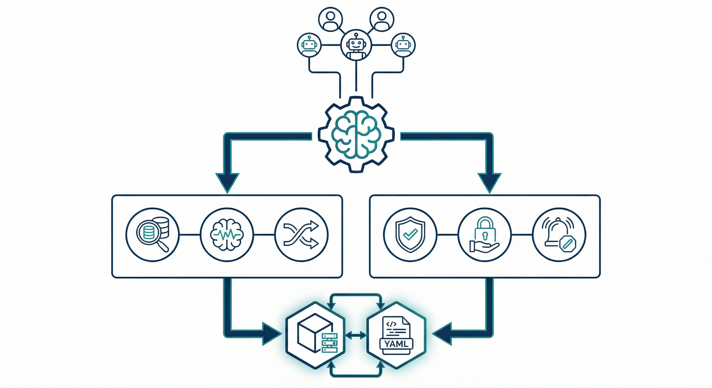

# Cognition Engines for agent-decisions

**Accelerators & Guardrails for Multi-Agent Decision Intelligence**

[](LICENSE)

## Overview

This project extends [agent-decisions](https://github.com/tfatykhov/agent-decisions) with **Cognition Engines** — the intelligence layer that enables:

- **Accelerators**: Cross-agent learning through semantic decision querying and pattern detection
- **Guardrails**: Policy enforcement that prevents violations before they occur

Based on Cisco Outshift's [Internet of Cognition](https://outshift.cisco.com/blog/from-connection-to-cognition-scaling-superintelligence) architecture.

## Architecture



**Components:**
- **Top:** AI Agents (humans + bots) connect to the Cognition Engines brain
- **Left (Accelerators):** Semantic Index, Pattern Detection, Cross-Agent Query
- **Right (Guardrails):** Policy Validation, Enforcement Hooks, Violation Alerts
- **Bottom:** Decision Store (ChromaDB + YAML files)

## Prerequisites

### Required
- **Python 3.10+**
- **ChromaDB** — Vector database for semantic search
- **Gemini API key** — For embeddings (free tier available)

### Recommended
- **[agent-decisions](https://github.com/tfatykhov/agent-decisions)** — Decision journal with Brier scoring

Cognition Engines works best with agent-decisions for:
- Consistent YAML schema for decisions
- Confidence calibration tracking (Brier scores)
- Multi-reason support with strength scoring
- K-line context bundles

**Without agent-decisions:** Cognition Engines can work with any YAML decision files that have these fields:
```yaml
title: "Decision title"
category: architecture | process | integration | tooling | security
confidence: 0.85  # 0.0-1.0
date: "2026-02-04T03:45:00Z"
context: "What you're deciding"
```

### ChromaDB (Vector Database)

**Option 1: Docker (Recommended)**
```bash
docker run -d \
  --name chromadb \
  -p 8000:8000 \
  -v chromadb_data:/chroma/chroma \
  chromadb/chroma:latest
```

**Option 2: Local Python**
```bash
pip install chromadb
# Runs embedded (no separate server needed)
```

### Embeddings Provider

You need an embeddings API. Supported providers:

| Provider | Model | Dimensions | Setup |
|----------|-------|------------|-------|
| **Gemini** (default) | text-embedding-004 | 768 | `export GEMINI_API_KEY=your_key` |
| OpenAI | text-embedding-3-small | 1536 | `export OPENAI_API_KEY=your_key` |
| Local | sentence-transformers | varies | `pip install sentence-transformers` |

**Get a Gemini API key:** https://aistudio.google.com/apikey (free tier available)

### Environment Variables

```bash
# Required
export GEMINI_API_KEY="your_gemini_api_key"

# Optional (if using Docker ChromaDB)
export CHROMA_HOST="localhost"
export CHROMA_PORT="8000"
```

Or create a `.env` file:
```
GEMINI_API_KEY=your_gemini_api_key
CHROMA_HOST=localhost
CHROMA_PORT=8000
```

## Quick Start

### Option 1: Docker (Recommended)

```bash
# Clone the repo
git clone https://github.com/tfatykhov/cognition-agent-decisions.git
cd cognition-agent-decisions

# Configure
cp .env.example .env
# Edit .env with your GEMINI_API_KEY and CSTP_AUTH_TOKENS

# Start (includes ChromaDB)
docker-compose up -d

# Verify
curl http://localhost:8100/health
# {"status":"healthy"}
```

See [docs/DOCKER.md](docs/DOCKER.md) for full deployment guide.

### Option 2: Local Installation

```bash
# Install dependencies
pip install -e .

# Index existing decisions
cognition index /path/to/decisions/

# Query similar decisions
cognition query "choosing database for agent memory"

# Check guardrails before a decision
cognition check --category architecture --stakes high --confidence 0.7

# Detect patterns
cognition patterns --min-decisions 10
```

## OpenClaw Skill Installation

If you're using OpenClaw, install as a skill:

```bash
# Copy to skills directory
cp -r skills/cognition-engines ~/.openclaw/workspace/skills/

# Or clone directly
git clone https://github.com/tfatykhov/cognition-agent-decisions.git
cp -r cognition-agent-decisions/skills/cognition-engines ~/.openclaw/workspace/skills/
```

Then use via uv:
```bash
uv run ~/.openclaw/workspace/skills/cognition-engines/scripts/query.py "your query"
uv run ~/.openclaw/workspace/skills/cognition-engines/scripts/check.py --stakes high
```

## Framework Compatibility

Cognition Engines is **agent-framework agnostic**. It's Python + ChromaDB — works anywhere.

### LangChain / LangGraph

```python
from cognition_engines.accelerators import SemanticIndex
from cognition_engines.guardrails import GuardrailEngine

# Add to your agent's decision step
def make_decision(context: str, confidence: float):
    # Query similar past decisions
    index = SemanticIndex()
    similar = index.query(context, top_k=5)
    
    # Check guardrails
    engine = GuardrailEngine()
    result = engine.check({"stakes": "high", "confidence": confidence})
    
    if not result.allowed:
        raise ValueError(f"Blocked: {result.violations}")
    
    return proceed_with_decision()
```

### AutoGen

```python
# In your AutoGen agent config
from cognition_engines.accelerators import SemanticIndex

class DecisionAgent(AssistantAgent):
    def __init__(self):
        self.decision_index = SemanticIndex()
    
    def before_decide(self, context):
        similar = self.decision_index.query(context)
        return f"Similar past decisions: {similar}"
```

### CrewAI

```python
from crewai import Agent, Task
from cognition_engines.guardrails import GuardrailEngine

# Create a guardrail-aware agent
guardrails = GuardrailEngine()

@tool
def check_decision(stakes: str, confidence: float) -> str:
    result = guardrails.check({"stakes": stakes, "confidence": confidence})
    return "Allowed" if result.allowed else f"Blocked: {result.message}"
```

### Any Python Agent

```python
# Direct script usage
import subprocess

# Query similar decisions
result = subprocess.run(
    ["python", "scripts/query.py", "your context"],
    capture_output=True, text=True
)
similar_decisions = result.stdout

# Check guardrails
result = subprocess.run(
    ["python", "scripts/check.py", "--stakes", "high", "--confidence", "0.8"],
    capture_output=True, text=True
)
```

## Multi-Agent Shared Memory

When using an **external vector database**, multiple agents can share the same decision memory and guardrails:


**Benefits:**
- 🔍 **Cross-agent queries** — "Has anyone in my team seen this before?"
- 🛡️ **Shared guardrails** — Org-level policies all agents inherit
- 📊 **Collective learning** — One agent's lessons benefit all
- 🔄 **Consistent decisions** — Same context → same guardrail checks

**Setup:**
```bash
# Point all agents to the same vector database
export CHROMA_HOST="your-shared-db.example.com"
export CHROMA_PORT="8000"
```

## Remote Access (CSTP)

**New in v0.7.0:** Cognition Engines now supports **CSTP (Cognition State Transfer Protocol)**, allowing remote agents to query your decision history via JSON-RPC.

**Endpoint:** `POST /cstp`

**Method: `cstp.queryDecisions`**
```json
{
  "jsonrpc": "2.0",
  "method": "cstp.queryDecisions",
  "params": {
    "query": "database migration",
    "filters": { 
      "category": "architecture", 
      "minConfidence": 0.8,
      "project": "owner/repo"
    }
  },
  "id": 1
}
```

**Method: `cstp.checkGuardrails`**
```json
{
  "jsonrpc": "2.0",
  "method": "cstp.checkGuardrails",
  "params": {
    "action": {
      "description": "Deploy to production",
      "category": "process",
      "stakes": "high",
      "confidence": 0.85,
      "context": {
        "affectsProduction": true,
        "codeReviewCompleted": true
      }
    }
  },
  "id": 2
}
```

**Method: `cstp.recordDecision`** *(New in v0.7.1)*
```json
{
  "jsonrpc": "2.0",
  "method": "cstp.recordDecision",
  "params": {
    "decision": "Use PostgreSQL for agent memory storage",
    "confidence": 0.85,
    "category": "architecture",
    "stakes": "high",
    "context": "Choosing database for long-term storage",
    "project": "owner/repo",
    "feature": "memory-persistence",
    "pr": 42,
    "reasons": [
      {"type": "analysis", "text": "ACID compliance needed", "strength": 0.9}
    ],
    "reviewIn": "30d"
  },
  "id": 3
}
```

Response:
```json
{
  "result": {
    "success": true,
    "id": "abc12345",
    "path": "decisions/2026/02/2026-02-05-decision-abc12345.yaml",
    "indexed": true,
    "timestamp": "2026-02-05T00:48:00Z"
  }
}
```

**Method: `cstp.attributeOutcomes`** *(New in v0.7.2)*
```json
{
  "jsonrpc": "2.0",
  "method": "cstp.attributeOutcomes",
  "params": {
    "project": "owner/repo",
    "stabilityDays": 14
  },
  "id": 4
}
```

See [CSTP Design](docs/CSTP-v0.7.0-DESIGN.md) for full protocol details.

## Guardrail Example

```yaml
# guardrails/cornerstone.yaml
id: no-high-stakes-low-confidence
description: High-stakes decisions require minimum confidence
condition:
  stakes: high
  confidence: "< 0.5"
action: block
message: "High-stakes decisions require ≥50% confidence"
```

## Roadmap

*Inspired by Cisco Outshift's [Internet of Cognition](https://outshift.cisco.com/blog/from-connection-to-cognition-scaling-superintelligence) architecture.*


| Version | Features | Status |
|---------|----------|--------|
| v0.5.0 | Semantic Decision Index | ✅ Shipped |
| v0.6.0 | Pattern Detection Engine | ✅ Shipped |
| v0.6.0 | Enhanced Guardrails + Audit Trail | ✅ Shipped |
| v0.7.0 | Cross-Agent Federation (CSTP) | ⚠️ Beta |
| v0.7.2 | Project Context & Attribution | ✅ Shipped |
| v0.8.0 | Shared Intent Protocol | Planned |
| v0.9.0 | Context Graphs | Planned |
| v1.0.0 | Multi-Agent Cognition Network | Planned |

### v0.7.0 — Cross-Agent Federation
- **Cross-agent query**: `query.py --scope=org` — search all agents' decisions
- **Federated ChromaDB**: Shared collection or cross-instance queries
- **Guardrail inheritance**: Org-level GATs that all agents inherit
- **Agent-specific overrides**: Local rules with audit trail

### v0.8.0 — Shared Intent Protocol
- **Decision proposals**: Multi-agent voting on shared decisions
- **Conflict resolution**: When agents disagree, structured negotiation
- **Intent alignment**: Agents negotiate common objectives before deciding
- **SSTP foundation**: Semantic State Transfer Protocol for human-auditable coordination

### v0.9.0 — Context Graphs
- **Entity relationships**: Not just decisions — connections between concepts
- **Knowledge transfer**: "What does Agent A know that Agent B needs?"
- **Emergent context**: Collective understanding beyond individual agents
- **CSTP support**: Compressed state for efficient cross-agent sync

### v1.0.0 — Multi-Agent Cognition Network
- **Semantic State Transfer**: Export decision context in portable format
- **Reasoning continuity**: Another agent can "resume" a decision thread
- **Collective innovation**: Agents reason together on novel problems
- **COGs + GATs**: Full cognitive amplifiers and guardrail technologies
- **Full protocol stack**: LSTP/CSTP/SSTP support based on use case

### Cognition State Protocols (Future)

Based on [Cisco Outshift's Internet of Cognition](https://outshift.cisco.com/blog/from-connection-to-cognition-scaling-superintelligence):

| Protocol | Layer | Use Case |
|----------|-------|----------|
| **SSTP** | Semantic | Human-auditable, policy-governed decisions. Cross-vendor strategic coordination. |
| **CSTP** | Compressed | Low-bandwidth environments (Edge, WAN). Abstracted feature representations. |
| **LSTP** | Latent | High-fidelity inference continuity. Local clusters with unified execution. |

**Our focus:** SSTP first — it's the decision-making layer. CSTP/LSTP for future performance optimization.

## Project Structure

```
cognition-agent-decisions/
├── src/
│   └── cognition_engines/
│       ├── accelerators/     # Query, patterns, learning
│       └── guardrails/       # Definitions, enforcement
├── a2a/                      # CSTP Protocol (Server/Client)
├── guardrails/               # YAML guardrail definitions
├── tests/                    # Test suite
├── docs/                     # Documentation
└── examples/                 # Usage examples
```

## Related Projects

- [agent-decisions](https://github.com/tfatykhov/agent-decisions) — Core decision journal
- [Membrain](https://github.com/tfatykhov/membrain) — Neuromorphic memory (future integration)

## License

Apache 2.0 — See [LICENSE](LICENSE)
