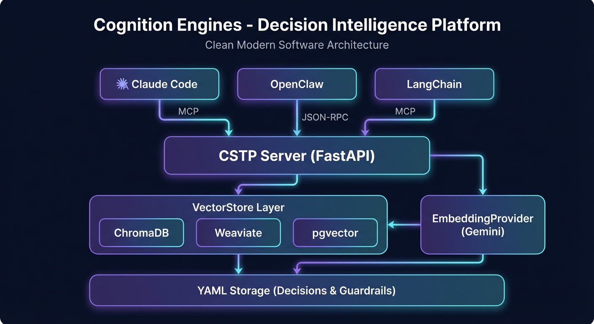

# Cognition Engines

**Decision Intelligence for AI Agents**

[](LICENSE)
[](https://cognition-engines.ai)

Cognition Engines gives AI agents a memory of their decisions — what they decided, why, and whether it worked. Agents query past decisions before acting, guardrails prevent known mistakes, and calibration tracking reveals whether the agent is actually getting better over time.

## Key Capabilities

- **Decision Memory**: Semantic search over past decisions with hybrid retrieval (vector + BM25)
- **Guardrails**: Policy enforcement that blocks unsafe actions before they happen, with [CEL](https://github.com/google/cel-spec) expressions for arbitrary conditions
- **Calibration**: Brier scoring tracks whether confidence predictions match actual outcomes
- **Provenance & Control Evidence**: Hash-chained audit evidence mapped to SR 11-7 and NIST AI RMF, exportable as a single bundle
- **Deliberation Traces**: Auto-captures the reasoning chain (queries, guardrail checks) leading to each decision
- **Bridge Search**: Query by structure ("what does it look like?") or function ("what problem does it solve?")
- **MCP + JSON-RPC**: Framework-agnostic — works with Claude Code, Claude Desktop, OpenClaw, LangChain, or raw curl
- **SQLite Storage**: WAL-mode SQLite with FTS5 full-text search. 8-42x faster than YAML. Auto-migration from YAML on startup
- **Pluggable Storage**: VectorStore abstraction supports ChromaDB (default), with Weaviate, pgvector, Qdrant planned

## Quick Start

### Try the Demo (Fastest)

```bash
git clone https://github.com/tfatykhov/cognition-agent-decisions.git
cd cognition-agent-decisions/demo

python3 seed_data.py          # Generate sample decisions
docker compose up --build     # Launch full stack

# Dashboard: http://localhost:8080 (admin / demo)
# Watch the MCP agent: docker compose logs -f demo-agent
```

The demo launches CSTP server + ChromaDB + Dashboard + a reference MCP agent that follows the [FORGE protocol](#forge-plugin-for-claude-code). See [demo/README.md](demo/README.md) for details.

### Docker (Production)

```bash
cp .env.example .env
# Edit .env: set GEMINI_API_KEY and CSTP_AUTH_TOKENS

docker compose up -d
curl http://localhost:8100/health
```

### Connect Claude Code

Add to your project's `.mcp.json`:

```json
{
  "mcpServers": {
    "decisions": {
      "command": "npx",
      "args": [
        "mcp-remote@latest",
        "http://YOUR_HOST:8100/mcp",
        "--allow-http",
        "--header",
        "Authorization: Bearer YOUR_CSTP_TOKEN"
      ]
    }
  }
}
```

On Windows, prefix with `"command": "cmd", "args": ["/c", "npx", ...]`.

### Connect Claude Desktop

Same config in `~/Library/Application Support/Claude/claude_desktop_config.json` (macOS) or `%APPDATA%\Claude\claude_desktop_config.json` (Windows).

### FORGE Plugin for Claude Code

**[FORGE](https://github.com/tfatykhov/cognition-engines-marketplace)** is a Claude Code plugin that implements the full decision loop as a protocol: **F**etch → **O**rient → **R**esolve → **G**o → **E**xtract.

```bash
# Install the plugin
claude --plugin-dir ./path-to-forge-plugin
```

FORGE automates the workflow via hooks - cognitive context loads at session start, guardrails check before risky operations, micro-thoughts stream during work, and reflection is enforced at session end. See the [FORGE repo](https://github.com/tfatykhov/cognition-engines-marketplace) for details.

## How It Works

```
Session start    → get_session_context       (load cognitive context)
       ↓
Decision point   → pre_action                (query + guardrails + record)
                   (auto_record: true)        → returns decisionId
       ↓
During work      → record_thought            (capture reasoning)
                   (decision_id: from above)  → thoughts attach in real-time
       ↓
After work       → update_decision           (finalize decision text)
                   (id: decisionId)
       ↓
Later            → review_outcome            (log success/failure)
```

### Multi-Agent Isolation

When multiple agents share an MCP connection, pass `agent_id` to scope deliberation:

```
pre_action(agent_id: "planner", ...)      → decisionId: "abc123"
record_thought(agent_id: "planner", decision_id: "abc123", ...)
update_decision(id: "abc123", ...)
```

Each agent's thoughts are tracked separately via composite keys (`agent:{id}:decision:{id}`).

### Primary MCP Tools

| Tool | Purpose |
|------|---------|
| `pre_action` **(PRIMARY)** | All-in-one: queries similar decisions, evaluates guardrails, fetches calibration, extracts patterns, optionally records. One call replaces 3. |
| `get_session_context` **(PRIMARY)** | Full cognitive context at session start: agent profile, relevant decisions, guardrails, calibration by category, ready queue, confirmed patterns. JSON or markdown output. |
| `ready` **(PRIMARY)** | Prioritized cognitive maintenance queue: overdue reviews, calibration drift, stale decisions. Filter by priority, type, category. |

### Granular MCP Tools

| Tool | Purpose |
|------|---------|
| `query_decisions` | Semantic/hybrid search over past decisions |
| `check_action` | Standalone guardrail validation |
| `log_decision` | Record a decision manually (last resort - prefer `pre_action` with `auto_record`) |
| `review_outcome` | Record success/failure for calibration |
| `get_stats` | Calibration statistics (Brier score, accuracy, drift) |
| `get_decision` | Full decision details by ID |
| `get_reason_stats` | Which reasoning types predict success |
| `update_decision` | Update decision text/context after work |
| `record_thought` | Capture reasoning steps during work |

### Graph Tools

| Tool | Purpose |
|------|---------|
| `link_decisions` | Create typed edges between decisions (`relates_to`, `supersedes`, `depends_on`) |
| `get_graph` | Query subgraph around a decision with configurable depth and edge type filters |
| `get_neighbors` | Lightweight neighbor query - direct connections for a decision with edge types and weights |

### Circuit Breaker Tools (F030)

| Tool | Purpose |
|------|---------|
| `get_circuit_state` | Current breaker state (`closed` / `open` / `half_open`) for a category |
| `list_breakers` | All tripped and recovering breakers |

## JSON-RPC API

All tools are also available via JSON-RPC 2.0 at `POST /cstp`:

```bash
curl -X POST http://localhost:8100/cstp \
  -H "Authorization: Bearer YOUR_TOKEN" \
  -H "Content-Type: application/json" \
  -d '{
    "jsonrpc": "2.0",
    "method": "cstp.preAction",
    "params": {
      "action": {
        "description": "Refactor auth to use JWT",
        "category": "architecture",
        "stakes": "high",
        "confidence": 0.85
      },
      "tags": ["auth", "refactor"],
      "pattern": "Stateless auth scales better than session-based"
    },
    "id": 1
  }'
```

**Available methods** (34 registered in `a2a/cstp/dispatcher.py`):

| Group | Methods |
|-------|---------|
| Decisions | `cstp.queryDecisions`, `cstp.recordDecision`, `cstp.updateDecision`, `cstp.getDecision`, `cstp.listDecisions`, `cstp.recordThought` |
| Guardrails | `cstp.checkGuardrails`, `cstp.listGuardrails` |
| Calibration | `cstp.reviewDecision`, `cstp.getCalibration`, `cstp.getStats`, `cstp.getReasonStats`, `cstp.attributeOutcomes`, `cstp.checkDrift` |
| Agentic loop | `cstp.preAction`, `cstp.getSessionContext`, `cstp.ready` |
| Graph (F045) | `cstp.linkDecisions`, `cstp.getGraph`, `cstp.getNeighbors` |
| Compaction (F041) | `cstp.compact`, `cstp.getCompacted`, `cstp.setPreserve`, `cstp.getWisdom` |
| Circuit breakers (F030) | `cstp.listBreakers`, `cstp.getCircuitState`, `cstp.resetCircuit` |
| Provenance (F055) | `cstp.ingestEvidence`, `cstp.linkEvidence`, `cstp.mapControls`, `cstp.exportEvidenceBundle`, `cstp.verifyEvidenceChain` |
| Ops | `cstp.reindex`, `cstp.debugTracker` |

The F055 provenance methods are JSON-RPC only — they have no MCP tool equivalents.

### Auto-Linking

When `recordDecision` is called with related decisions (from `pre_action` or explicit `related_to`), the graph is automatically updated with `relates_to` edges. No manual `linkDecisions` call needed for common relationships.

### Debug Tracker

Inspect live deliberation state for debugging multi-agent flows:

```bash
curl -X POST http://localhost:8100/cstp \
  -H "Authorization: Bearer YOUR_TOKEN" \
  -H "Content-Type: application/json" \
  -d '{"jsonrpc":"2.0","method":"cstp.debugTracker","params":{},"id":1}'
```

Returns active tracker sessions with composite keys, input counts, thought text, and age.

## Architecture



### Storage (F050)

Decision storage uses SQLite (WAL mode, FTS5) by default. Vector search uses ChromaDB.

```bash
# Decision storage (default: sqlite)
CSTP_STORAGE=sqlite
CSTP_DB_PATH=data/decisions.db

# Vector storage (default: chromadb)
VECTOR_BACKEND=chromadb
EMBEDDING_PROVIDER=gemini

# Testing: in-memory (no external services)
VECTOR_BACKEND=memory

# Auto-migration: YAML decisions are migrated to SQLite on startup
```

## Core Concepts

### Deliberation Traces (F023)

When an agent calls `query_decisions` or `check_action` before recording a decision, the server auto-captures these as deliberation inputs. The full reasoning chain is attached to the decision record — zero client changes needed.

### Bridge Definitions (F024)

Based on Minsky's *Society of Mind*. Decisions are indexed by both **structure** (what it looks like) and **function** (what it does). Use `bridgeSide` to search by intent or form:

```json
{"method": "cstp.queryDecisions", "params": {"query": "rate limiting", "bridgeSide": "function"}}
```

### Decision Quality (F027)

Decisions are scored for retrieval quality based on completeness of tags, patterns, context, and bridge definitions. The `pattern` field captures the abstract lesson — making decisions findable by purpose, not just keywords.

### Guardrails

```yaml
# guardrails/cornerstone.yaml
id: no-high-stakes-low-confidence
description: High-stakes decisions require minimum confidence
condition:
  stakes: high
  confidence: "< 0.5"
action: block
message: "High-stakes decisions require ≥50% confidence"
```

### CEL Expression Guardrails (F054)

Conditions can also be written as [CEL](https://github.com/google/cel-spec) expressions, which reach
fields the legacy key/value form cannot — in particular the caller-supplied `context` dict:

```yaml
id: require-architecture-review
description: Architecture decisions require an architecture review
condition: "action.category == 'architecture' && !action.context.architecture_review"
action: block
message: "Architecture decisions require architecture_review: true"
```

The activation exposes `action.description`, `.stakes`, `.confidence`, `.category`, `.tags`,
`.reason_count`, `.pattern`, `.quality_score`, `.has_tags`, `.has_pattern`, and everything else
the caller passed under `action.context.*`. Full boolean logic, comparisons, `in`, `size()`, and
`contains()` are available.

Legacy key/value conditions are auto-converted to CEL at evaluation time, so existing guardrail
files keep working unchanged — no migration needed. Evaluation **fails open**: a guardrail whose
expression fails to compile or raises at runtime is skipped and logged, never treated as a block.

See the [guardrails authoring guide](https://cognition-engines.ai/reference/guardrails-authoring) for
the full field reference.

### Decision Provenance & Control Evidence (F055)

Turns CSTP's decision history into an artifact an auditor can accept. Evidence falls into exactly
two classes that are **never blended into one number**:

- **Observed** — third-party events from a system the agent does not control (GitHub PR opens,
  reviews, approvals, merges). Ingested via `cstp.ingestEvidence` and SHA-256 hash-chained, so any
  later edit breaks the chain.
- **Attested** — first-party CSTP decision records linked to observed events via `cstp.linkEvidence`.
  Self-reported, and an auditor discounts them accordingly.

Coverage is reported separately per class. A control satisfied only by attested evidence is flagged
`attested_only`. Hand-written YAML rules in `a2a/cstp/provenance/mappings/` map evidence to
**SR 11-7** (Federal Reserve MRM) and **NIST AI RMF 1.0** controls; where evidence does not honestly
support a control, the mapper emits `INSUFFICIENT_EVIDENCE` with a plain-English reason rather than
stretching the mapping.

```bash
# Map stored evidence to controls
curl -X POST http://localhost:8100/cstp \
  -H "Authorization: Bearer YOUR_TOKEN" \
  -d '{"jsonrpc":"2.0","method":"cstp.mapControls","params":{},"id":1}'

# Export the auditor-facing bundle
curl -X POST http://localhost:8100/cstp \
  -H "Authorization: Bearer YOUR_TOKEN" \
  -d '{"jsonrpc":"2.0","method":"cstp.exportEvidenceBundle","params":{"format":"json"},"id":1}'
```

Evidence lives in its own SQLite WAL database, separate from the decision store:

```bash
PROVENANCE_DB=~/.cstp/provenance.db   # default
```

PDF bundles need the optional `pdf` extra (`pip install -e ".[pdf]"`, included in `[all]`). JSON
bundles have no extra dependency. See [website/specs/f055-decision-provenance.md](website/specs/f055-decision-provenance.md).

## Roadmap

See [docs/features/INDEX.md](docs/features/INDEX.md) for the complete feature catalog and [TODO.md](TODO.md) for prioritized work items.

| Version | Features | Status |
|---------|----------|--------|
| v0.8.0 | Core CSTP Server, Docker, Dashboard (F001-F011) | ✅ Shipped |
| v0.9.0 | Hybrid Retrieval, Drift Alerts, Calibration (F014-F017) | ✅ Shipped |
| v0.10.0 | MCP Server, Deliberation Traces, Bridge Definitions, Quality (F019-F028) | ✅ Shipped |
| v0.11.0 | Pre-Action Hook, Session Context, Website (F046-F048) | ✅ Shipped |
| v0.14.0 | Multi-Agent Isolation, Live Deliberation Viewer, Memory Compaction, Graph Storage (F041, F044-F045, F049) | ✅ Shipped |
| v0.15.0 | SQLite Storage, Auto-Migration, 8-42x Performance, Enriched Search, Dashboard Integration (F050) | ✅ Shipped |
| v0.16.0 | Full Stack Demo, Circuit Breakers, CEL Guardrails, Decision Provenance (F051, F030, F054, F055) | 🚧 On `main`, unreleased |

`pyproject.toml` still reports `0.15.0`; the v0.16.0 features above are merged to `main` but not yet tagged.

### Upcoming

| Priority | Features |
|----------|----------|
| **P1** | F054-b Decision Admission Gate, Weaviate/pgvector backends |
| **P2** | F052 Dashboard Export (Grafana/Prometheus), F053 Query Deduplication Cache, F055 P2 PDF bundle improvements |
| **P3** | F034 Decomposed Confidence, F035-F039 Multi-Agent Federation, F043 Distributed Merge, F055 P3 EU AI Act mapping |

### Research Foundations

- [Cisco Outshift — Internet of Cognition](https://outshift.cisco.com/blog/from-connection-to-cognition-scaling-superintelligence) (SSTP/CSTP/LSTP protocol layers)
- Minsky — *Society of Mind* (bridge definitions, censor layer, decomposed confidence)
- [Beads](https://github.com/steveyegge/beads) (task graphs, memory compaction, work discovery)
- Context Graphs, MemoBrain, Graph-Constrained Reasoning (ICML 2025)

## Project Structure

```
cognition-agent-decisions/
├── a2a/cstp/                  # CSTP services
│   ├── dispatcher.py          # JSON-RPC routing (34 methods)
│   ├── query_service.py       # Hybrid retrieval
│   ├── decision_service.py    # Record, update, retrieve
│   ├── calibration_service.py # Brier scoring, rolling windows
│   ├── guardrails_service.py  # Policy evaluation + F054 CEL evaluator
│   ├── preaction_service.py   # F046 Pre-action hook
│   ├── session_context_service.py # F047 Session context
│   ├── deliberation_tracker.py # F023 Auto-capture
│   ├── provenance_service.py  # F055 Evidence ingest, mapping, bundles
│   ├── provenance/            # F055 Control framework mapping
│   │   ├── mapping.py         # YAML rules engine
│   │   └── mappings/          # sr11-7, nist-ai-rmf, cstp-attested
│   ├── vectordb/              # F048 Pluggable vector storage
│   │   ├── chromadb.py        # ChromaDB backend
│   │   └── memory.py          # In-memory backend (testing)
│   └── embeddings/            # F048 Pluggable embeddings
│       └── gemini.py          # Gemini backend
├── a2a/mcp_server.py          # MCP Server (17 tools)
├── a2a/cstp/storage/          # F050 Pluggable decision storage
│   ├── sqlite.py              # SQLite backend (WAL, FTS5)
│   ├── yaml_fs.py             # YAML backend (legacy)
│   ├── memory.py              # In-memory backend (testing)
│   └── provenance.py          # F055 Hash-chained evidence store
├── a2a/server.py              # FastAPI server
├── dashboard/                 # Web dashboard (Flask)
├── demo/                      # Full stack demo (docker compose)
├── docs/features/             # Feature specs (F001-F055)
├── guardrails/                # YAML guardrail definitions
├── tests/                     # Test suite
├── website/                   # VitePress docs (cognition-engines.ai)
├── CLAUDE.md                  # Claude Code project context
└── TODO.md                    # Prioritized roadmap
```

## Documentation

- **Website**: [cognition-engines.ai](https://cognition-engines.ai)
- **API Reference**: [cognition-engines.ai/reference/api](https://cognition-engines.ai/reference/api)
- **MCP Quick Start**: [cognition-engines.ai/reference/mcp-quickstart](https://cognition-engines.ai/reference/mcp-quickstart)
- **Feature Specs**: [docs/features/INDEX.md](docs/features/INDEX.md)

## License

Apache 2.0 — See [LICENSE](LICENSE)
