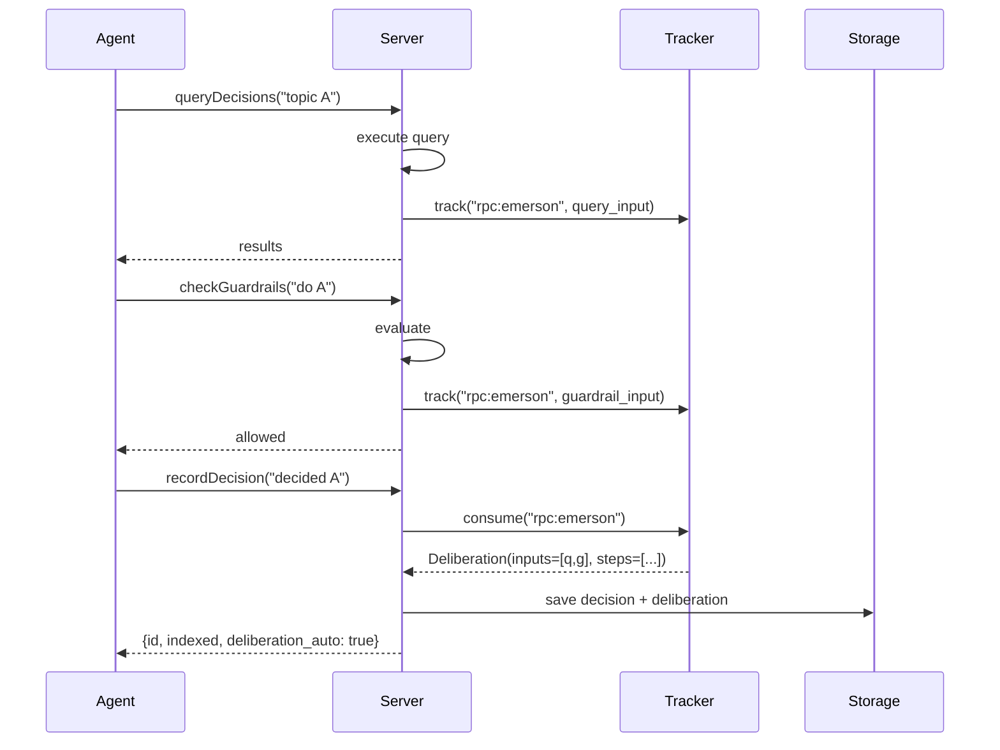

# F023 Phase 2: Server-Side Auto-Capture — Implementation Plan

## Author: ⚡ Emerson
## Date: 2026-02-08
## Status: Approved by Tim

## Overview

Add a `DeliberationTracker` to the CSTP server that automatically captures
query and guardrail check results as deliberation inputs, then attaches them
to decisions when `recordDecision` is called. Works for both JSON-RPC and
MCP transports with zero client changes.

## Architecture

```
                    JSON-RPC                    MCP
                   (/cstp)                   (/mcp/)
                      │                         │
                      ▼                         ▼
               ┌─────────────┐           ┌───────────┐
               │ dispatcher  │           │ mcp_server │
               └──────┬──────┘           └─────┬─────┘
                      │                        │
            ┌─────────┼────────────────────────┼─────────┐
            │         ▼                        ▼         │
            │  key: "rpc:{agent_id}"   key: "mcp:{sid}"  │
            │         │                        │         │
            │         └────────┐  ┌────────────┘         │
            │                  ▼  ▼                      │
            │         ┌──────────────────┐               │
            │         │ DeliberationTracker               │
            │         │                  │               │
            │         │ _sessions: dict  │               │
            │         │   key → [TrackedInput, ...]      │
            │         │                  │               │
            │         │ track()          │               │
            │         │ consume() → Deliberation         │
            │         │ cleanup_expired()│               │
            │         └──────────────────┘               │
            │                                            │
            └──────── deliberation_tracker.py ───────────┘
```

## Tracked Events

| CSTP Method | Tracked As | Input Summary |
|-------------|-----------|---------------|
| `cstp.queryDecisions` | `query` | "Queried '{query}': {N} results ({mode})" + top 3 IDs |
| `cstp.checkGuardrails` | `guardrail` | "Checked '{description}': {allowed/blocked}" + violation count |
| `cstp.getDecision` | `lookup` | "Retrieved decision {id}: {title}" |
| `cstp.getReasonStats` | `stats` | "Reviewed reason stats: {N} types, {diversity}" |

## Step-by-Step Implementation

### Step 1: Create `deliberation_tracker.py` (~180 lines)

**File:** `a2a/cstp/deliberation_tracker.py`

```python
"""F023 Phase 2: Server-side deliberation auto-capture."""

from __future__ import annotations

import time
import threading
from dataclasses import dataclass, field
from typing import Any

from .decision_service import Deliberation, DeliberationInput, DeliberationStep


@dataclass
class TrackedInput:
    """A single tracked input from an API call."""
    id: str                    # auto-generated: "q-{hash8}" / "g-{hash8}" / etc.
    type: str                  # "query" | "guardrail" | "lookup" | "stats"
    text: str                  # human-readable summary
    source: str                # "cstp:queryDecisions" / "cstp:checkGuardrails" / etc.
    timestamp: float           # time.time() when tracked
    raw_data: dict[str, Any]   # method-specific details


@dataclass
class TrackerSession:
    """Accumulated inputs for one agent/session."""
    inputs: list[TrackedInput] = field(default_factory=list)
    created_at: float = field(default_factory=time.time)
    last_activity: float = field(default_factory=time.time)


class DeliberationTracker:
    """Tracks API calls per agent/session for auto-deliberation capture.
    
    Thread-safe. Singleton instance shared across dispatcher and MCP server.
    """
    
    def __init__(self, ttl_seconds: int = 300):
        self._sessions: dict[str, TrackerSession] = {}
        self._ttl = ttl_seconds
        self._lock = threading.Lock()
    
    def track(self, key: str, tracked_input: TrackedInput) -> None:
        """Register an input for the given agent/session key."""
        ...
    
    def consume(self, key: str) -> Deliberation | None:
        """Build Deliberation from tracked inputs and clear them.
        
        Returns None if no inputs were tracked.
        Called during recordDecision.
        """
        ...
    
    def get_inputs(self, key: str) -> list[TrackedInput]:
        """Peek at current tracked inputs without consuming."""
        ...
    
    def cleanup_expired(self) -> int:
        """Remove sessions older than TTL. Returns count removed."""
        ...
    
    def _build_deliberation(self, inputs: list[TrackedInput]) -> Deliberation:
        """Convert tracked inputs into a Deliberation object.
        
        Auto-generates steps from the input sequence:
        - Groups sequential same-type inputs into one step
        - Last step gets conclusion=True
        - Each step references which input IDs it used
        """
        ...


# Singleton instance
_tracker: DeliberationTracker | None = None

def get_tracker(ttl_seconds: int = 300) -> DeliberationTracker:
    """Get or create the global tracker instance."""
    global _tracker
    if _tracker is None:
        _tracker = DeliberationTracker(ttl_seconds=ttl_seconds)
    return _tracker
```

**Key behaviors:**

1. `track()` — Appends input to session, updates `last_activity`
2. `consume()` — Returns `Deliberation` with auto-built steps, clears session
3. `_build_deliberation()` — Creates steps from input sequence:
   - Each unique call type becomes a step
   - Step references the input IDs it used
   - Total duration = last input timestamp - first input timestamp
   - Last step gets `conclusion=False` (the decision itself is the conclusion)
4. Thread-safe via `threading.Lock` (asyncio dict ops are atomic for single-threaded, but lock protects multi-worker scenarios)

### Step 2: Create tracker helper functions (~50 lines)

**File:** `a2a/cstp/deliberation_tracker.py` (continued)

Helper functions to generate `TrackedInput` from each API response:

```python
def track_query(key: str, query: str, result_count: int, 
                top_ids: list[str], retrieval_mode: str) -> None:
    """Track a queryDecisions call."""
    input_id = f"q-{uuid4().hex[:8]}"
    tracker = get_tracker()
    tracker.track(key, TrackedInput(
        id=input_id,
        type="query",
        text=f"Queried '{query[:50]}': {result_count} results ({retrieval_mode})",
        source="cstp:queryDecisions",
        timestamp=time.time(),
        raw_data={
            "query": query,
            "result_count": result_count,
            "top_ids": top_ids[:5],
            "retrieval_mode": retrieval_mode,
        },
    ))


def track_guardrail(key: str, description: str, allowed: bool,
                    violation_count: int) -> None:
    """Track a checkGuardrails call."""
    ...

def track_lookup(key: str, decision_id: str, title: str) -> None:
    """Track a getDecision call."""
    ...

def track_stats(key: str, total_decisions: int, 
                reason_type_count: int) -> None:
    """Track a getReasonStats call."""
    ...
```

### Step 3: Hook into dispatcher.py (~30 lines changed)

**File:** `a2a/cstp/dispatcher.py`

**3a. After `_handle_query_decisions` returns:**
```python
# At end of _handle_query_decisions, before return:
from .deliberation_tracker import track_query

track_query(
    key=f"rpc:{agent_id}",
    query=request.query,
    result_count=result.total,
    top_ids=[d.id for d in result.decisions[:5]],
    retrieval_mode=request.retrieval_mode,
)
return result.to_dict()
```

**3b. After `_handle_check_guardrails` returns:**
```python
from .deliberation_tracker import track_guardrail

track_guardrail(
    key=f"rpc:{agent_id}",
    description=request.action.description,
    allowed=eval_result.allowed,
    violation_count=len(eval_result.violations),
)
```

**3c. After `_handle_get_decision` returns:**
```python
from .deliberation_tracker import track_lookup

if result.get("found"):
    track_lookup(
        key=f"rpc:{agent_id}",
        decision_id=params.get("id", ""),
        title=result["decision"].get("summary", "")[:50],
    )
```

**3d. In `_handle_record_decision`, before saving:**
```python
from .deliberation_tracker import get_tracker

# Auto-attach deliberation if none provided
if not request.deliberation or not request.deliberation.has_content():
    tracker = get_tracker()
    auto_delib = tracker.consume(f"rpc:{agent_id}")
    if auto_delib:
        request.deliberation = auto_delib
elif request.deliberation:
    # Merge: append tracked inputs to explicit deliberation
    tracker = get_tracker()
    auto_delib = tracker.consume(f"rpc:{agent_id}")
    if auto_delib and auto_delib.inputs:
        existing_ids = {i.id for i in request.deliberation.inputs}
        for inp in auto_delib.inputs:
            if inp.id not in existing_ids:
                request.deliberation.inputs.append(inp)
```

### Step 4: Hook into mcp_server.py (~30 lines changed)

**File:** `a2a/mcp_server.py`

Same hooks as dispatcher, but using MCP session ID:

```python
# Extract session key from MCP context
# The session_id comes from the Mcp-Session-Id header
# For MCP, use "mcp:{session_id}" as tracker key

# After _handle_query_decisions:
track_query(key=f"mcp:{session_id}", ...)

# After _handle_check_action:
track_guardrail(key=f"mcp:{session_id}", ...)

# In _handle_log_decision:
auto_delib = tracker.consume(f"mcp:{session_id}")
```

**Challenge:** Accessing the MCP session ID from within tool handlers.
The `mcp` library's `call_tool` handler receives the tool name and arguments
but not the session context directly. Solutions:
- Use `contextvars.ContextVar` set by the HTTP handler before dispatching
- Or pass session_id through a thread-local / task-local variable
- Fallback: use `"mcp:default"` if session ID unavailable (still better than nothing)

### Step 5: Periodic cleanup

**File:** `a2a/cstp/deliberation_tracker.py`

Add cleanup to the tracker that runs on each `track()` call (probabilistic)
or via a background task:

```python
def track(self, key: str, tracked_input: TrackedInput) -> None:
    with self._lock:
        # Probabilistic cleanup: ~1% of calls
        if random.random() < 0.01:
            self.cleanup_expired()
        
        if key not in self._sessions:
            self._sessions[key] = TrackerSession()
        session = self._sessions[key]
        session.inputs.append(tracked_input)
        session.last_activity = time.time()
```

### Step 6: Tests (~200 lines)

**File:** `tests/test_deliberation_tracker.py`

| Test | What it verifies |
|------|-----------------|
| `test_track_and_consume` | Basic track → consume → Deliberation returned |
| `test_consume_clears` | After consume, second consume returns None |
| `test_multiple_agents_isolated` | Agent A inputs don't leak to Agent B |
| `test_ttl_expiry` | Inputs older than TTL are cleaned up |
| `test_auto_steps_generated` | Steps created from input sequence |
| `test_merge_explicit_deliberation` | Tracked inputs appended to explicit deliberation |
| `test_no_deliberation_when_empty` | No inputs → no auto-deliberation |
| `test_thread_safety` | Concurrent track/consume doesn't crash |
| `test_cleanup_expired` | cleanup_expired removes old sessions |
| `test_track_query_helper` | `track_query()` creates correct TrackedInput |
| `test_track_guardrail_helper` | `track_guardrail()` creates correct TrackedInput |
| `test_track_lookup_helper` | `track_lookup()` creates correct TrackedInput |

## File Summary

| File | Action | Lines (est.) |
|------|--------|-------------|
| `a2a/cstp/deliberation_tracker.py` | **NEW** | ~230 |
| `a2a/cstp/dispatcher.py` | Modify | +40 |
| `a2a/mcp_server.py` | Modify | +40 |
| `tests/test_deliberation_tracker.py` | **NEW** | ~200 |
| `docs/specs/F023-DELIBERATION-TRACES.md` | Updated | (done) |
| `docs/specs/F023-PHASE2-IMPLEMENTATION.md` | **NEW** | this file |

**Total new code:** ~510 lines

## Sequence Diagram



## Response Changes

`recordDecision` response gains a new field:

```json
{
  "success": true,
  "id": "abc123",
  "indexed": true,
  "deliberation_auto": true,
  "deliberation_inputs_count": 2
}
```

This tells the client that deliberation was auto-captured and how many
inputs were attached, without requiring any client changes.

## Rollout

1. Build and test locally
2. PR with code review
3. Deploy — immediately starts capturing for all agents
4. Verify by recording a decision and checking the YAML has auto-deliberation
5. No migration needed — purely additive, backward compatible

## Edge Cases

| Scenario | Behavior |
|----------|----------|
| No queries before record | No deliberation attached (same as today) |
| Queries but no record within TTL | Inputs expire, cleaned up |
| Multiple records in quick succession | First gets all inputs, second gets none (or only post-first inputs) |
| Server restart | In-memory tracker resets (acceptable — deliberation is best-effort) |
| Explicit + auto deliberation | Merge: tracked inputs appended to explicit |
| Very old inputs (>TTL) | Excluded from auto-deliberation |
