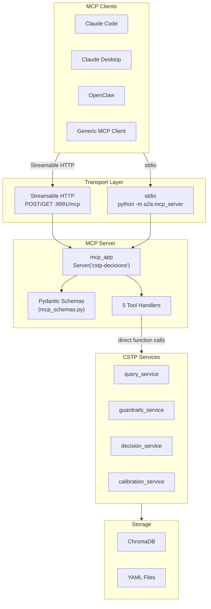

# MCP Integration Guide

> **Since:** v0.9.0  
> **Protocol:** [Model Context Protocol](https://modelcontextprotocol.io/) (MCP)

This guide covers connecting MCP-compliant agents to CSTP decision intelligence. The MCP layer exposes the same capabilities as the JSON-RPC API through a standardized tool interface.

---

## Architecture

The MCP server is a **thin bridge** over the existing CSTP dispatcher. Each MCP tool maps 1:1 to a CSTP service method — there is zero business logic duplication.



Key design principles:

- **Bridge pattern** — MCP tools validate inputs via Pydantic, then delegate to CSTP services
- **Shared server instance** — Both stdio and Streamable HTTP use the same `mcp_app` and tool handlers
- **Zero duplication** — No business logic in the MCP layer; all logic lives in CSTP services

---

## Connection Methods

### Streamable HTTP (Remote)

The CSTP FastAPI server mounts the MCP handler at `/mcp` on port 9991. The endpoint handles both `POST` (tool calls) and `GET` (event streams) on the same path.

```
http://your-server:9991/mcp
```

**Requirements:** The CSTP server must be running (Docker or local).

### stdio (Local / Docker)

The MCP server can run as a standalone process communicating over stdin/stdout:

```bash
# Direct (requires Python env with dependencies)
python -m a2a.mcp_server

# Via Docker (recommended)
docker exec -i cstp python -m a2a.mcp_server
```

**Requirements:** The container/environment must have `CHROMA_URL`, `GEMINI_API_KEY`, and `DECISIONS_PATH` configured.

---

## Client Setup

### Claude Code

```bash
claude mcp add --transport http cstp-decisions http://your-server:9991/mcp
```

After adding, CSTP tools appear in Claude Code's tool list automatically.

### Claude Desktop

Add to your Claude Desktop configuration file (`claude_desktop_config.json`):

```json
{
  "mcpServers": {
    "cstp": {
      "command": "docker",
      "args": ["exec", "-i", "cstp", "python", "-m", "a2a.mcp_server"],
      "env": {}
    }
  }
}
```

> **Note:** The CSTP container must be running. The MCP server inherits all environment variables (`CHROMA_URL`, `GEMINI_API_KEY`, etc.) from the container.

### OpenClaw

Point OpenClaw's MCP client configuration to the Streamable HTTP endpoint:

```
http://your-server:9991/mcp
```

Or configure stdio transport to launch the MCP server process directly.

### Generic MCP Client

Any client implementing the [MCP specification](https://modelcontextprotocol.io/) can connect via either transport. The server advertises itself as `cstp-decisions` and exposes 7 tools via the standard `tools/list` method.

---

## Available Tools

### `query_decisions`

Search similar past decisions using semantic search, keyword matching, or hybrid retrieval. Returns matching decisions with confidence scores, categories, and outcomes.

**Use before making new decisions to learn from history.**

```json
{
  "query": "database migration strategy",
  "limit": 5,
  "retrieval_mode": "hybrid",
  "filters": {
    "category": "architecture",
    "project": "owner/repo"
  }
}
```

**Input Schema:**

| Field | Type | Required | Default | Description |
|-------|------|----------|---------|-------------|
| `query` | string | ✅ | — | Natural language query (min 1 char) |
| `limit` | int | ❌ | 5 | Maximum results (1–50) |
| `retrieval_mode` | `"semantic"` \| `"keyword"` \| `"hybrid"` | ❌ | `"hybrid"` | Search mode |
| `bridge_side` | `"structure"` \| `"function"` \| `"both"` | ❌ | `"both"` | Search by bridge side |
| `filters` | object | ❌ | — | See below |

**Filters:**

| Field | Type | Description |
|-------|------|-------------|
| `category` | string | `architecture`, `process`, `integration`, `tooling`, `security` |
| `stakes` | string[] | `low`, `medium`, `high`, `critical` |
| `project` | string | Project in `owner/repo` format |
| `has_outcome` | bool | Filter to decisions with/without recorded outcomes |

**Output:** List of matching decisions with IDs, titles, confidence scores, categories, stakes, dates, and similarity distances.

---

### `check_action`

Validate an intended action against safety guardrails and policies. Returns whether the action is allowed, any blocking violations, and warnings.

**Always check before high-stakes actions.**

```json
{
  "description": "Deploy to production without tests",
  "stakes": "high",
  "confidence": 0.6
}
```

**Input Schema:**

| Field | Type | Required | Default | Description |
|-------|------|----------|---------|-------------|
| `description` | string | ✅ | — | Action you intend to take (min 1 char) |
| `category` | string | ❌ | — | Action category |
| `stakes` | `"low"` \| `"medium"` \| `"high"` \| `"critical"` | ❌ | `"medium"` | Stakes level |
| `confidence` | float | ❌ | — | Your confidence (0.0–1.0) |

**Output:** `allowed` boolean, list of violations (blocking), list of warnings, count of evaluated guardrails.

---

### `log_decision`

Record a decision to the immutable decision log. Include what you decided, your confidence level, category, and supporting reasons.

**Use after making a decision to build calibration history.**

```json
{
  "decision": "Use PostgreSQL for the new service",
  "confidence": 0.85,
  "category": "architecture",
  "stakes": "high",
  "context": "Evaluated PostgreSQL vs MongoDB for the analytics service",
  "reasons": [
    {"type": "analysis", "text": "Need ACID transactions for financial data"},
    {"type": "pattern", "text": "Team has strong PostgreSQL expertise"}
  ],
  "project": "owner/repo",
  "pr": 42,
  "bridge": {
    "structure": "PostgreSQL",
    "function": "persistence"
  }
}
```

**Deliberation Auto-Capture:**
When `log_decision` is called, the server automatically attaches a "deliberation trace" if you previously called `query_decisions` or `check_action` within the same session. This captures the "chain of thought" leading to the decision without extra effort.

**Input Schema:**

| Field | Type | Required | Default | Description |
|-------|------|----------|---------|-------------|
| `decision` | string | ✅ | — | What you decided — state the choice |
| `confidence` | float | ✅ | — | Confidence (0.0–1.0) |
| `category` | `"architecture"` \| `"process"` \| `"integration"` \| `"tooling"` \| `"security"` | ✅ | — | Decision category |
| `stakes` | `"low"` \| `"medium"` \| `"high"` \| `"critical"` | ❌ | `"medium"` | Stakes level |
| `context` | string | ❌ | — | Situation context |
| `reasons` | array | ❌ | — | Supporting reasons (see below) |
| `tags` | string[] | ❌ | — | Tags for categorization |
| `project` | string | ❌ | — | Project in `owner/repo` format |
| `feature` | string | ❌ | — | Feature or epic name |
| `pr` | int | ❌ | — | Pull request number (≥ 1) |
| `bridge` | object | ❌ | — | Bridge definition (structure/function) |

**Bridge object:**

| Field | Type | Description |
|-------|------|-------------|
| `structure` | string | What it looks like (pattern) |
| `function` | string | What problem it solves (purpose) |
| `tolerance` | string[] | Features that don't matter |
| `enforcement` | string[] | Features that must be present |
| `prevention` | string[] | Features that must be absent |

**Reason object:**

| Field | Type | Description |
|-------|------|-------------|
| `type` | `"authority"` \| `"analogy"` \| `"analysis"` \| `"pattern"` \| `"intuition"` | Reasoning type |
| `text` | string | Explanation |

**Output:** Decision ID, file path, indexed status, and timestamp.

---

### `review_outcome`

Record the outcome of a past decision. Provide the decision ID, whether it succeeded or failed, what actually happened, and lessons learned.

**Builds calibration data over time.**

```json
{
  "id": "a1b2c3d4",
  "outcome": "success",
  "actual_result": "PostgreSQL handled the load well, no issues",
  "lessons": "ACID transactions were indeed critical for data integrity"
}
```

**Input Schema:**

| Field | Type | Required | Description |
|-------|------|----------|-------------|
| `id` | string | ✅ | Decision ID (8-char hex) |
| `outcome` | `"success"` \| `"partial"` \| `"failure"` \| `"abandoned"` | ✅ | Outcome of the decision |
| `actual_result` | string | ❌ | What actually happened |
| `lessons` | string | ❌ | Lessons learned |
| `notes` | string | ❌ | Additional review notes |

**Output:** Review status, updated path, and reindex confirmation.

---

### `get_stats`

Get calibration statistics: Brier score, accuracy, confidence distribution, and decision counts. Optionally filter by category, project, or time window.

**Use to check decision-making quality.**

```json
{
  "category": "architecture",
  "window": "90d"
}
```

**Input Schema:**

| Field | Type | Required | Description |
|-------|------|----------|-------------|
| `category` | string | ❌ | Filter by category |
| `project` | string | ❌ | Filter by project (`owner/repo`) |
| `window` | `"30d"` \| `"60d"` \| `"90d"` \| `"all"` | ❌ | Rolling time window |

**Output:** Brier score, accuracy, confidence distribution, decision counts, and confidence variance metrics.

---

## Error Handling

All MCP tool errors are returned as `TextContent` containing a JSON object:

```json
{
  "error": "validation_error",
  "message": "1 validation error for QueryDecisionsInput\nquery\n  Field required [type=missing, ...]"
}
```

| Error Type | Cause |
|------------|-------|
| `validation_error` | Invalid input — Pydantic schema validation failed |
| `internal_error` | Unexpected server error — check server logs |

The MCP server logs to stderr (stdout is reserved for the MCP protocol). Check container logs for debugging:

```bash
docker logs cstp 2>&1 | grep "cstp-mcp"
```

---

## Authentication

- **Streamable HTTP** — Inherits authentication from the FastAPI bearer token middleware. The same `CSTP_AUTH_TOKENS` apply.
- **stdio** — No bearer token authentication. Security relies on process-level isolation (e.g., Docker container, local access).

---

## Local Development

```bash
# 1. Install with MCP support
pip install -e ".[a2a,mcp,dev]"

# 2. Set required environment variables
export CHROMA_URL=http://localhost:8000
export GEMINI_API_KEY=your-key
export DECISIONS_PATH=./decisions

# 3. Run MCP server (stdio)
python -m a2a.mcp_server

# 4. Or start the full server (includes /mcp endpoint)
python -m uvicorn a2a.server:app --host 0.0.0.0 --port 9991
```

---

## Tool-to-Method Mapping

| MCP Tool | CSTP JSON-RPC Method | Service Module |
|----------|----------------------|----------------|
| `query_decisions` | `cstp.queryDecisions` | `a2a/cstp/query_service.py` |
| `check_action` | `cstp.checkGuardrails` | `a2a/cstp/guardrails_service.py` |
| `log_decision` | `cstp.recordDecision` | `a2a/cstp/decision_service.py` |
| `review_outcome` | `cstp.reviewDecision` | `a2a/cstp/decision_service.py` |
| `get_stats` | `cstp.getCalibration` | `a2a/cstp/calibration_service.py` |
